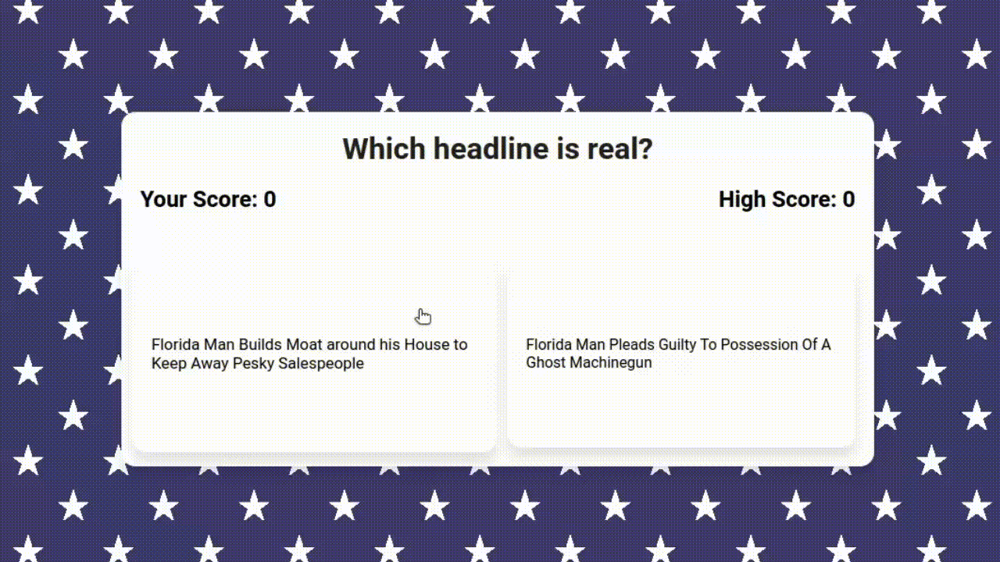

#Florida Man Game: Guess the True Headline!

##Overview

Welcome to the [Florida Man Game](https://cr-daniel.github.io/florida-men/), a fun and engaging web game that tests your ability to discern fact from fiction. Inspired by the popular Florida Man meme, this game presents players with two outrageous headlines at a time, challenging them to guess which is the real Florida Man headline.

##Features

* True and False Headlines: The game presents you with real and made-up Florida Man headlines. Your task is to identify the real one.

* Scoring: For every correct guess, you earn a point. But be careful! A single wrong guess resets your score to zero.

* High Score Tracking: The game keeps track of your high score, pushing you to improve your game and beat your previous records.

##Tech Stack

* HTML5: Markup language for creating the structure of the web pages.

* CSS3: Styling language for designing the look and feel of the web pages.

* JavaScript: Scripting language for adding interactivity to the web pages.

Thank you for checking out the Florida Man Game! Dive in and enjoy the fun.